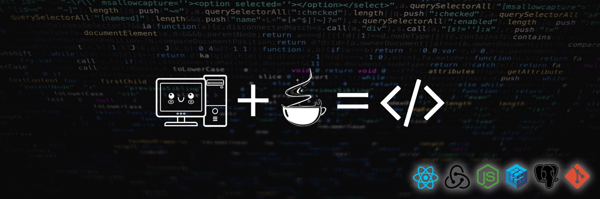
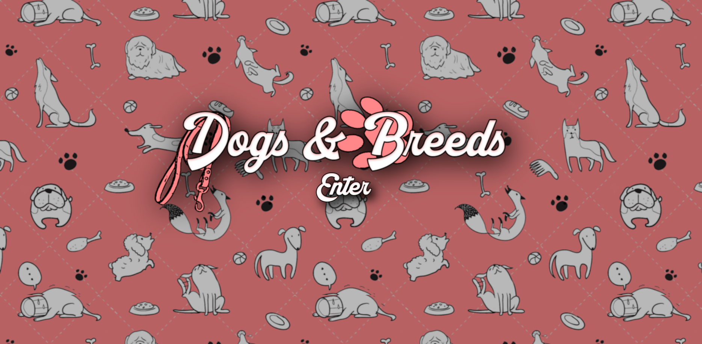
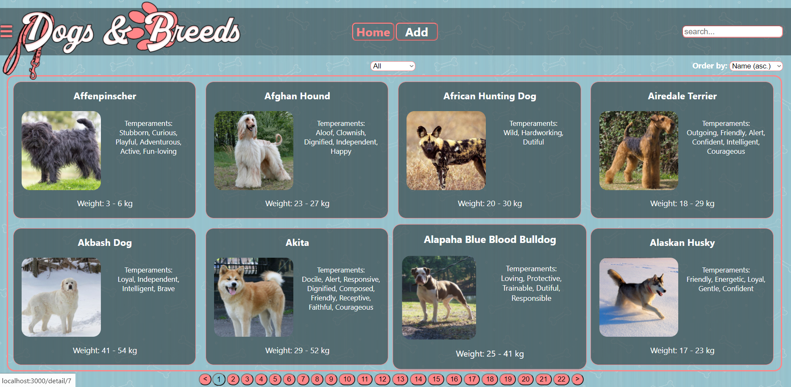
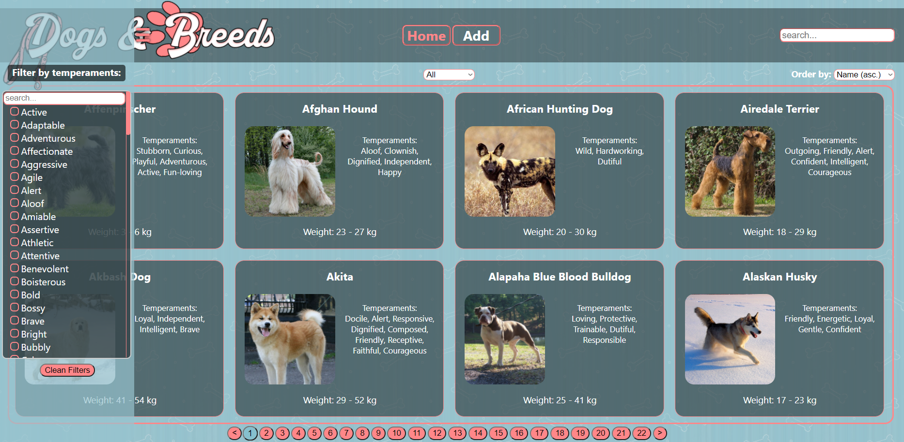
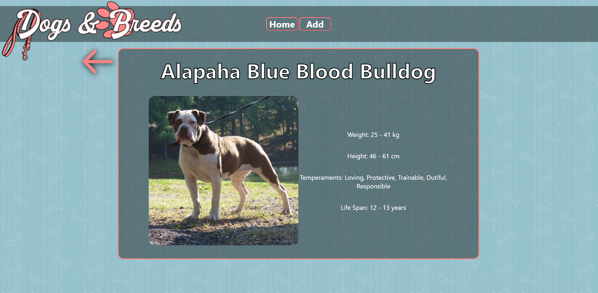

<h3>
Hola! Me llamo Luan👋
</h3>

Soy Full Stack Developer y Pastelero😊

Soy amante del diseño web y me gusta mucho trabajar en el Front.
Sin embargo puedo desenvolverme en el Back con la misma pasión.

## Proyectos🌈
<a href="https://github.com/LuanKlett/Dogs-PI">Dogs App</a>

## Contacto📮
 
luanklett@gmail.com💌
 
<a href="https://www.linkedin.com/in/pablo-daniel-klett/">LinkedIn</a>

<!--
**LuanKlett/LuanKlett** is a ✨ _special_ ✨ repository because its `README.md` (this file) appears on your GitHub profile.

Here are some ideas to get you started:

- 🔭 I’m currently working on ...
- 🌱 I’m currently learning ...
- 👯 I’m looking to collaborate on ...
- 🤔 I’m looking for help with ...
- 💬 Ask me about ...
- 📫 How to reach me: ...
- 😄 Pronouns: ...
- ⚡ Fun fact: ...
-->
